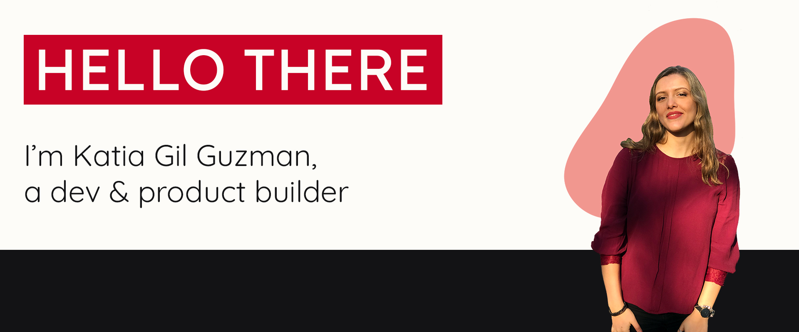

👋 Welcome to my little corner of the GitHub universe!

💻 My journey began as a Software Engineer at Microsoft, where I honed my skills and learned the art of software craftsmanship.

✨ After a while, my entrepreneurial spirit made me venture out and co-found a startup, taking up the mantle of CTO.

These days, I'm a Solutions Architect at Stripe, helping businesses build amazing payment experiences.

I'm also working on SaaS projects as a side-hustle, and my goal is to become a serial *SaaSpreneur* - I've actually just created [a blog](https://saaspreneur.club) where I will share my journey building SaaS businesses.

I've tinkered and toyed with a plethora of languages and frameworks but currently I'm mostly using Vue 3. I used to play around with Python and React a lot, so you'll find some of that here, along with C# repos which are a relic of my videogame development experiments. 

Feel free to take a look!
